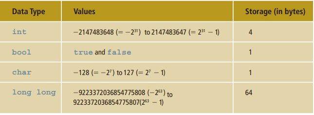

## There are three categories of simple data: 📅
1. Integral, which is a data type that deals with integers, or numbers without a decimal part 🔢

2. Floating point, which is a data type that deals with decimal numbers 
3. Enumeration, which is a user-defined data type 🎱
>Integral data types are further classified into the following categories: char, short,
int, long, bool, unsigned char, unsigned short, unsigned int, unsigned long,
long long, and unsigned long long.
<html><body>

</body></html>
> Type Conversion (Casting)
>
To avoid implicit type coercion, C11 provides for explicit type conversion through 
the use of a cast operator. The cast operator, also called type conversion or type 
casting, takes the following form:
<code>static_cast<dataTypeName>(expression)<code>

static_cast<int>(7.9) evaluates to 7
static_cast<int>(3.3) evaluates to 3
static_cast<double>(25) evaluates to 25.0
static_cast<double>(5 + 3) evaluates to 8.0
static_cast<double>(15) / 2 evaluates to = static_cast<int>(7.8 + 7.5)
= static_cast<int>(15.3)
= 15
Note , first expression is evaluted then data type is changed so in above example (15)/2 is resolved first 
